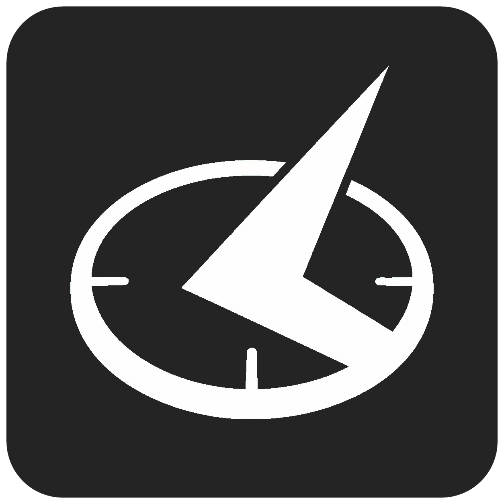

# Sundial



Sundial edits accounts and settings for [Project Sunrise](https://github.com/stanuwu/Sunrise) and [Dawn](https://github.com/isinternets/Dawn), and includes Parhelion for authoring your own weapons and other items. It reads items from your installed Destiny 2 packages. No game assets are bundled.

- Edit characters, equipment, subclasses, and inventories.
- Search weapons, armor, cosmetics, and perks.
- Inspect the definitions behind items, perks, and progression, with model previews.
- Randomize loadouts and adjust armor stats.
- Change game settings, progression, and Collections.
- Use the JSON editor for settings not covered by the guided interface.
- Author custom weapons and other items with [Parhelion](crates/parhelion/README.md).

## Compatibility

- Destiny 2 Shadowkeep build `86657.20.08.23`
- Project Sunrise 0.5 or newer (settings schema v18 and SQLite schema v2)
- Dawn 0.1.3 or newer (`player-state.db` schema v5)
- Windows 10 or Linux x86-64 (glibc 2.35 or later)

Newer Sunrise schemas may be opened with a warning, but future compatibility is not guaranteed.

Sunrise schema v18 stores most account data in `data/investment.sqlite3`, with identity and runtime configuration in `settings.json`. Dawn stores account data, preferences, and key bindings in `player-state.db`, with identity, language, and runtime configuration in `Dawn/settings.json`. Sundial selects the active format automatically and still supports legacy Sunrise JSON accounts.

## Getting started

1. Download the build for your platform from [Releases](https://github.com/kylethmpsn/sundial/releases).
2. Run `sundial.exe` on Windows or `sundial` on Linux.
3. Choose the Destiny 2 installation you use with Project Sunrise or Dawn.

The first launch scans the game packages. Later launches use a cached catalog. Sundial rebuilds it when the package set changes or when you update Sundial. You can also rebuild it under **Preferences > Installation > Catalog**.

On Linux, the first package scan downloads a hash-verified decompression helper (`liblinoodle3.so`). The Linux archive also includes an optional `install.sh` for adding Sundial to your application launcher.

Close Destiny 2 before saving account changes, restoring backups, or installing custom packages. Relaunch the game afterward to load your changes.

## Parhelion

Parhelion is an experimental item workbench bundled with Sundial. Build your own Destiny weapons by mixing weapon types, perks, stats, and appearance, including Exotics and combinations that wouldn't normally exist in the sandbox. It can also author custom perks, gear, Shaders, and Subclass abilities.

Parhelion creates its own Tiger-compatible packages in your existing installation without modifying existing packages. Enable it under **Preferences > Editing > Experimental**, then choose **Open Parhelion**. Some combinations may not work and can freeze or crash the game. Before using future Dawn versions with online support, uninstall custom packages or Dawn may report an error. Please [report any issues](https://github.com/kylethmpsn/sundial/issues) with your recipe and a description of what happens in-game.

See the [Parhelion README](crates/parhelion/README.md) for more about the authoring workflow.

## Backups and local files

Sundial backs up account data and settings before saving, checks for outside changes, and preserves unknown JSON fields. Backups are kept separately for each installation. Open the backup folder or reset settings under **Preferences > Saving & recovery**.

| Data | Windows | Linux |
| --- | --- | --- |
| Preferences | `%LOCALAPPDATA%\Sundial\preferences.json` | `${XDG_CONFIG_HOME:-~/.config}/sundial/preferences.json` |
| Backups | `%LOCALAPPDATA%\Sundial\backups` | `${XDG_DATA_HOME:-~/.local/share}/sundial/backups` |
| Caches | `%LOCALAPPDATA%\Sundial\cache` | `${XDG_CACHE_HOME:-~/.cache}/sundial` |
| Parhelion | `%LOCALAPPDATA%\Sundial\parhelion` | `${XDG_DATA_HOME:-~/.local/share}/sundial/parhelion` |
| Activity logs | `%LOCALAPPDATA%\Sundial\logs` | `${XDG_DATA_HOME:-~/.local/share}/sundial/logs` |

## Frequently asked questions

### Can I use Sundial with the current live version of Destiny 2?

No. Sundial supports the Project Sunrise and Dawn runtimes with the Shadowkeep version listed under **Compatibility**, not the current live game.

### Does Sundial change my loadout while Destiny 2 is running?

No. Close Destiny 2 before saving so Sundial doesn't conflict with the game's own writes, then relaunch it so Project Sunrise or Dawn loads your changes. For live in-game equipment editing, use [Sunrise Gear Editor](https://github.com/WalterGerig/SunriseGearEditor), a separate project, with Sunrise, or the built-in **Loadout Studio** in the Dawn menu with Dawn. Loadout Studio uses some of the same inventory-editing technology as Sundial, with a Destiny-inspired UI.

### What do the plug-safety levels do?

These control how broadly Sundial searches for plugs, not whether an experimental combination is guaranteed to work:

| Mode | Choices shown |
| --- | --- |
| Compatible | Plugs listed as supported by the item. |
| Socket + Item Subtype (default) | Plugs matching both the socket and the item's subtype, such as Sidearm. |
| Socket Type | Plugs matching the socket, even if not supported by this item. |
| Item Subtype | Plugs found anywhere on the item's subtype, such as every Sidearm, regardless of socket. |
| Item Type | Plugs found anywhere on every Weapon or every piece of Armor, regardless of socket. |
| All | Every discovered plug, regardless of compatibility. |

The plug picker itself carries the same control, labeled by the socket and item it is picking for. For example, Gnawing Hunger's barrel socket offers **Gnawing Hunger Barrels**, **Auto Rifle Barrels**, **All Barrels**, **Auto Rifles**, **All Weapons** and **All**, as Dawn's Loadout Studio does.

Broader choices can cause loading failures or crashes. Sundial warns before enabling **All**. Backups are still created when saving experimental selections.

### Why is the first launch slower?

Sundial builds its catalog from your existing game packages, then caches it. The cache is tied to the version that wrote it, so the first launch after an update rebuilds it once. It does not download a Destiny manifest or game assets. On Linux, the first scan also downloads the verified decompression helper described above.

### What should I include when reporting a problem?

Include steps to reproduce the problem and any error message or screenshot. Use **Preferences > Installation > Troubleshooting > Copy Report** to include diagnostics. A copy of the active runtime's `settings.json`, `investment.sqlite3`, or `player-state.db` may also help diagnose settings or startup issues.

For Parhelion issues, include the recipe and describe what happens in-game.

Report bugs through [GitHub Issues](https://github.com/kylethmpsn/sundial/issues). You can also reach me on Discord or Twitter/X as `kylethmpsn`.

## Building

Requires Rust 1.95 or later. The repository pins Rust 1.99.0 in `rust-toolchain.toml`, so rustup installs that toolchain on the first build.

```sh
cargo build --release --locked -p sundial-suite
```

The executable is `target/release/sundial.exe` on Windows or `target/release/sundial` on Linux.

## Credits and licensing

- [tiger-pkg](https://github.com/v4nguard/tiger-pkg) provides the Destiny 2 package reader. This project would not be possible without it.
- Package-layout research was informed by Sunrise, [Charm](https://github.com/MontagueM/Charm), and [Alkahest](https://github.com/cohaereo/alkahest), whose Pre-Beyond Light branch helped guide the model preview.
- Thanks to [Solus](https://www.youtube.com/@Solus-yt) for creating the Project Sunrise logo used in Parhelion's badge and inspiring its watermark.
- Thanks to [soul](https://github.com/chnsw) for creating the Dawn icon used in Parhelion's badge and inspiring its watermark, and to [Flumoxxed](https://www.youtube.com/@flumx) for the SVG!
- [justrealmilk/destiny-icons](https://github.com/justrealmilk/destiny-icons) provides optional alternative icons for custom perks, badges, and watermarks.
- Thanks to [Kjam0678](https://github.com/Kjam0678/panoptes/) for their work on the Panoptes fork, which inspired Sundial's socket-grid layout option and Randomize Loadout features.
- Thanks to xSkullHD for the original Random Item design and contributions to Sundial's armor-stat targeting.
- Thanks to Nox for his help in researching [unnamed armor plugs and their stat allocations](https://docs.google.com/spreadsheets/d/1U2DNRla6--q8PbU41QcqT2ku50hq5ew8uxy7r1tKe4c/edit).

Sundial was built with assistance from AI and reviewed by a real person. If you are not comfortable with the use of AI in programming, you may want to avoid this project.

Sundial is licensed under GPL-3.0-only. Third-party notices are included in release builds.

This project is not affiliated with Bungie Inc. or Sony Interactive Entertainment. Destiny 2 and its related IP are property of Bungie Inc.

If you would like to support [Project Sunrise](https://github.com/stanuwu/Sunrise), please direct that support to stanuwu for their work on the project.
